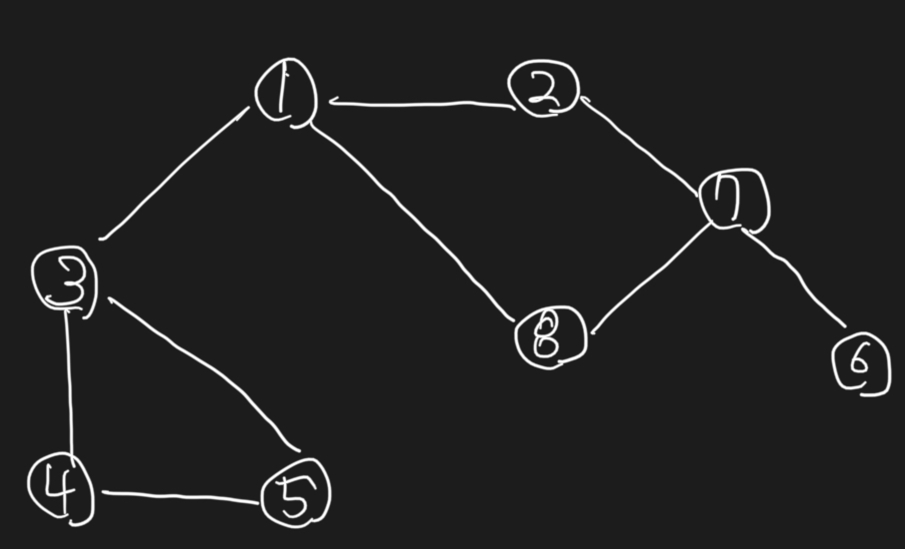

# Algorithm Overview

## :one:&nbsp; Greedy

## :two:&nbsp; DFS & BFS

1. DFS(Depth-first Search)

    > Tree 및 Graph 등의 자료구조에 대한 <u><b>경로 탐색</b></u>에 활용되는 알고리즘

    :point_right:&nbsp; ***Overview***
    - 루트 노드를 기준으로 탐색 시작 (그래프의 경우 임의의 노드를 지정)
    - 현재 노드를 기준으로 갈 수 있는 만큼 노드 탐색을 수행하고, 더이상 못가는 지점에 도달한다면 백트래킹을 수행.
    - 아직 방문하지 않은 모든 노드들에 대해 해당 과정 반복

    :point_right:&nbsp; ***Idea for iterative DFS algorithm***
    - `visited_array`, `stack` 생성 및 초기화
      - `visited_array`: 방문 정보를 저장할 배열 생성.
      - `stack`: 노드들에 대한 방문을 수행하는 과정에서, 방문을 진행하고자하는 노드들을 저장할 스택 생성.
      - 첫 번째로 방문을 수행할 노드를 스택에 삽입.

    - 스택에 저장한 방문할 노드가 남아있는 동안 반복 수행
      - 스택의 최상단 노드를 `pop`함.
      - `DFS의 노드 탐색 순서를 출력해야 하는 경우, pop된 요소를 출력하면 됨.`
      - 스택에서 `pop`된 노드(`current node`)를 기준으로, 인접해있는 모든 노드 중 아직 방문하지 않은 노드를 모두 스택에 `push`하고 `방문 처리`함.


    <details>
      <summary>Show Example Graph</summary>

      
    </details>

    <details>
      <summary>Python Implementation</summary>

      ```py
      class Graph:
        def __init__(self, V, is_bidirect = True):
          self.V = V # 정점의 갯수, 정점은 1부터 시작
          self.adj = [ [] for _ in range(self.V + 1)]
          self.is_bidirect = is_bidirect
          self.visited = [False for _ in range(self.V + 1)]


        def addEdge(self, v, w):
          self.adj[v].append(w)
          if self.is_bidirect == True:
            self.adj[w].append(v) # bi-directional graph

        # 정점 s로부터 아직 방문하지 않은 모든 노드에 대한 방문 수행
        def dfs(self, s = 1):
          stack = [s]
          
          while stack:
            s = stack.pop()

            """
            스택에서 pop된 노드가 아직 방문하지 않은 노드인 경우만 출력.
            스택에 동일한 정점이 2번 들어갈 수 있기 때문.
            """
            if (not self.visited[s]):
              print(s, end=" ")
              self.visited[s] = True

            """
            정점 s와 연결된 모든 정점에 대해 순차적으로
            해당 정점이 아직 방문하지 않은 정점이라면, 스택에 삽입함.
            """
            for node in self.adj[s][::-1]:
              if (not self.visited[node]):
                stack.append(node)
        
        
        g = Graph(8)
        g.addEdge(1, 2)
        g.addEdge(1, 3)
        g.addEdge(1, 8)
        g.addEdge(2, 7)
        g.addEdge(3, 4)
        g.addEdge(3, 5)
        g.addEdge(4, 5)
        g.addEdge(6, 7)
        g.addEdge(7, 8)

        g.dfs() # 1 -> 2 -> 7 -> 6 -> 8 -> 3 -> 4 -> 5

      ```

    </details>

    </br>

    :point_right:&nbsp; ***Idea for Recursive DFS algorithm***
    - dummy


    <details>
      <summary>Python Implementation</summary>

      ```py

      ```

    </details>


    :point_right:&nbsp; ***언제 사용할까?***
      - 그래프의 완전 탐색 시 활용 가능
      - 그래프의 연결 요소 개수 구할 때 활용 가능

2. BFS

    > Tree 및 Graph 등의 자료구조에 대한 <u><b>경로 탐색</b></u>에 활용되는 알고리즘

    :point_right:&nbsp; ***Overview***
    - dummy

    :point_right:&nbsp; ***Idea for BFS algorithm***
    - dummy
    
    <details>
      <summary>Python Implementation</summary>

      ```py

      ```

    </details>

    </br>

    :point_right:&nbsp; ***Idea for Recursive DFS algorithm***
    - dummy


    :point_right:&nbsp; ***언제 사용할까?***
      - 그래프의 완전 탐색 시 활용 가능
      - 그래프의 연결 요소 개수 구할 때 활용 가능

* 사용하는 케이스
  * 그래프의 완전 탐색 시 활용 가능
  * 그래프의 연결 요소 개수 구할 때 활용 가능
  * 그래프의 최단거리 탐색 시 활용 가능

## :three:&nbsp; Binary Search

