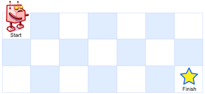
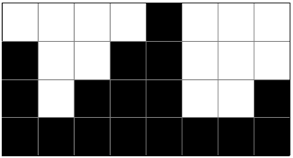

# Dynamic Programming

## :one:&ensp; Dynamic Programming 이란?

Dynamic Programmig은 복잡한 문제를 여러 개의 하위 문제(sub-problem)으로 나누어 해결하는 방식. DP는 작은 문제와 큰 문제가 동일한 구조를 가져, 큰 문제의 답을 구할 시 작은 문제에서 구한 결과를 기억하고, 이를 그대로 사용해 수행 속도를 높인 방법을 말함.

<br/>

### ***1. Dynamic Programming 설계 패러다임으로 해결 가능한 문제의 조건***

DP는 문제가 다음 두 가지의 조건을 만족하는 경우 사용이 가능함.

1. `Optimal Substructrue(최적 부분 구조)`

    주어진 문제에 대한 최적해를 구하고자 할 때, 부분 문제의 최적 결과 값을 결합하여 전체 문제의 최적 결과값(optimal solution)을 구할 수 있는 경우를 의미함. 다시 말해 특정 문제의 정답은 문제의 크기에 관계 없이 항상 동일해야 함.(Optimal Substructure는 그리디 알고리즘에서도 유사하게 적용됨.)

2. `Overlapping Subproblems(부분 문제 반복)`

    sub-problem 간에 중복되는 경우가 여러번 발생하는 경우를 말함. DP는 기본적으로 문제를 나누고 문제의 결과 값을 재활용하여 전체 답을 구함. 따라서 동일한 작은 문제들이 반복적으로 나타나는 경우 사용이 가능함. 다시 말해, DP는 부분 문제의 결과를 저장(Memoization)하여, 같은 답을 중복해서 구하는 과정을 제거한 방법이다. 따라서 부분 문제가 반복적으로 나타나지 않는다면 재사용이 불가능해짐.

<br/>

### ***2. Dynamic Programming 문제의 구현 방법***

DP는 다음 두 가지 방식으로 구현 가능함.

* `top-down`: 문제를 여러 개의 하위 문제(sub-problem)을 나누고, 하위 문제에서 구한 답을 결합하여 최종적으로 최적해를 구하는 방식.

  * `memoization`: 하위 문제에서 구한 답을 저장해놨다가 이후에 값을 계산하지 않고 가져다가 쓰는 방식.

* `bottom-up`: top-down 방식과 달리 하위 문제들로 상위 문제의 최적해를 구하는 방식.

---
## :two: Dynamic Programming의 접근 방법 및 예시

`10000번째 피보나치 수를 구하는 문제`를 Dynamic Programming 설계 패러다임으로 해결하는 과정을 살펴보자.

<br/>

### ***1. 모든 답을 만들어 보고 그 중 최적해의 점수를 반환하는 완전 탐색 알고리즘을 설계함.***

가장 먼저 해당 문제가 모든 경우의 수를 체크하여 답이 나오는 문제인지 살펴봐야 함. n번째 피보나치 수를 구하는 문제는 `f(n) = f(n-1) + f(n-2)` 식으로 정의 가능함. 다시말해 n번째 피보나치 수를 구하는 것은 1 ~ n-1 번째까지 피보나치 수를 완전 탐색으로 모두 구하면 됨.

<br/>

### ***2. 전체 답의 점수를 반환하는 것이 아니라, 앞으로 남은 선택들에 해당하는 점수만을 반환하도록 부분 문제의 정의를 변경함.***

위에서 설계한 피보나치 알고리즘은 0 ~ n-1 번째 까지 모든 답을 구한 다음, 이를 활용해 n번째 피보나치 수를 구하는 방식.

위에서 설계한 피보나치 문제를 해결하기 위한 완전탐색 패러다임을 DP 패러다임으로 변환하여 적용하기 위해서는 DP의 2가지 조건인 `Optimal Substructure(최적 부분 구조)`와 `Overlapping Subproblems(부분 문제 반복)`를 만족해야 함.

먼저, 피보나치 문제는 문제 자체가 `fibo(n) = fibo(n-1) + fibo(n-2)`로 정의되어 있음. 따라서 주어진 문제가 부분 문제로 변환이 가능하고, 부분 문제의 최적 결과 값을 사용해서, 전체 문제의 최적 결과값을 구할 수 있는 `Optimal Substructure`의 조건을 만족함.

이를 코드로 표현하면 다음과 같음.

```py
def fibo(number):
    if number == 0:
        return 0
    elif number == 1:
        return 1
    else:
        return fibo(number - 1) + fibo(number - 2)
```

다음으로 피보나치 문제는 동일한 작은 문제들이 반복적으로 나타나는 `Overlapping Subproblems(부분 문제 반복)`의 특성을 가지고 있음.

따라서 피보나치 문제는 Dynamic Programming 패러다임으로 최적화가 가능함.

<br/>

### ***3. 재귀 호출의 입력 이전 선택에 대한 정보가 있다면, 꼭 필요한 것만을 남기고 줄임.***

최적화 과정.

<br/>

### ***4. 입력이 배열이거나 문자열인 경우, 가능하다면 적절한 변환을 거쳐 메모이제이션 할 수 있도록 조정함.***

최적화 과정.

<br/>

### ***5. 메모이제이션을 적용함.***

마지막으로 피보나치 문제의 `Overlapping Subproblems(부분 문제 반복)` 특성에 대해 중복을 제거하기 위해, 메모이제이션을 적용하면 됨.

이를 코드로 표현하면 다음과 같음.

```py
import sys
sys.setrecursionlimit(40000)

memo = [0] * (10001)
def fibo(number):
    if number == 0 or number == 1:
        return number
    
    if memo[number] == 0:
        memo[number] = fibo(number - 1) + fibo(number - 2)
        
    return memo[number]
```

<br/>

### ***6. top-down -> bottom-up 변환을 통한 성능 최적화***

일반적으로 top-down 방식은 콜스택이 쌓이는 과정이 들어가기 때문에, bottom-up 방식에 비해 약간의 성능 저하가 유발될 수 있음. 따라서 top-down 방식의 알고리즘을 bottom-up 방식으로 변환한다면 성능 향상이 가능함.

```py
def fibo(number):
    # initialze 0'th, 1'th fibo number sequence.
    sequence = [0, 1]

    for i in range(2, number+1):
        # add i'th number to fibo number sequence.
        sequence.append(sequence[i-2] + sequence[i-1]) 

    return sequence[number]
```

<br/>

---
## :three:&ensp; 대표적 동적 계획법 문제

|문제 유형|설명|문제|
|-|-|-|
|[Fibonacci Number](./fibonacci_number/README.md)|n번째 피보나치 수 구하기|BOJ-1003|
|Jump Game|1번 돌에서 N번 돌까지 특정 조건을 만족하면서 점프를 해 갈 때, 필요한 최소의 점프 횟수를 구하기|BOJ-2253|
|Unique Paths Problem|가능한 모든 고유한 경로의 수 구하기<br/>|Leetcode-62-Unique-Paths|
|Rain Terraces (Trapping Rain Water) Problem|빗물 가두기.<br/>|BOJ-14719|
|Recursive Staircase Problem(재귀 계단 문제)|정상에 도달하는 방법의 수 세기.<br/>|
|Assembly-line scheduling|생산 라인에서 최소 경로를 구하기.<br/>||
|Rod cutting|막대 자르기||
|Matrix-chain multiplication|||
|Seam Carving|||
|Levenshtein Distance|||
|Longest Common Subsequence (LCS)|||
|Longest Common Substring|||
|Longest Increasing Subsequence|||
|Shortest Common Supersequence|||
|0/1 Knapsack Problem|||
|Integer Partition|||
|Maximum Subarray|||
|Bellman-Ford Algorithm |||
|Floyd-Warshall Algorithm|||
|Regular Expression Matching|||

<br/>

---
## Reference

* https://hongjw1938.tistory.com/47

* 동빈북

* https://github.com/JaeYeopHan/Interview_Question_for_Beginner/tree/master/Algorithm

* https://github.com/trekhleb/javascript-algorithms