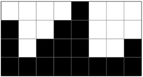
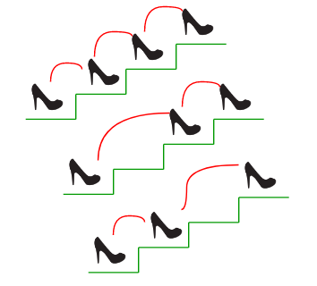
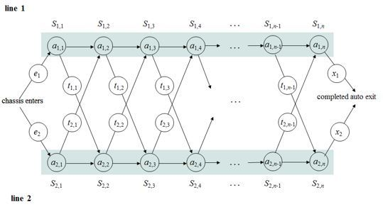

# :three:&ensp; 대표적 동적 계획법 문제

|문제 유형|설명|문제|
|-|-|-|
|[Fibonacci Number](./fibonacci_number/README.md)|n번째 피보나치 수 구하기|BOJ-1003|
|Jump Game|1번 돌에서 N번 돌까지 특정 조건을 만족하면서 점프를 해 갈 때, 필요한 최소의 점프 횟수를 구하기|BOJ-2253|
|Unique Paths Problem|가능한 모든 고유한 경로의 수 구하기 |Leetcode-62-Unique-Paths|
|Rain Terraces (Trapping Rain Water) Problem|빗물 가두기. |BOJ-14719|
|Recursive Staircase Problem(재귀 계단 문제)|정상에 도달하는 방법의 수 세기. |
|Assembly-line scheduling|생산 라인에서 최소 경로를 구하기. ||
|Rod cutting|막대 자르기||
|Matrix-chain multiplication|||
|Seam Carving|||
|Levenshtein Distance|||
|Longest Common Subsequence (LCS)|||
|Longest Common Substring|||
|Longest Increasing Subsequence|||
|Shortest Common Supersequence|||
|0/1 Knapsack Problem|||
|Integer Partition|||
|Maximum Subarray|||
|Bellman-Ford Algorithm |||
|Floyd-Warshall Algorithm|||
|Regular Expression Matching|||

 

---
## Reference

* https://hongjw1938.tistory.com/47

* 동빈북

* https://github.com/JaeYeopHan/Interview_Question_for_Beginner/tree/master/Algorithm

* https://github.com/trekhleb/javascript-algorithms