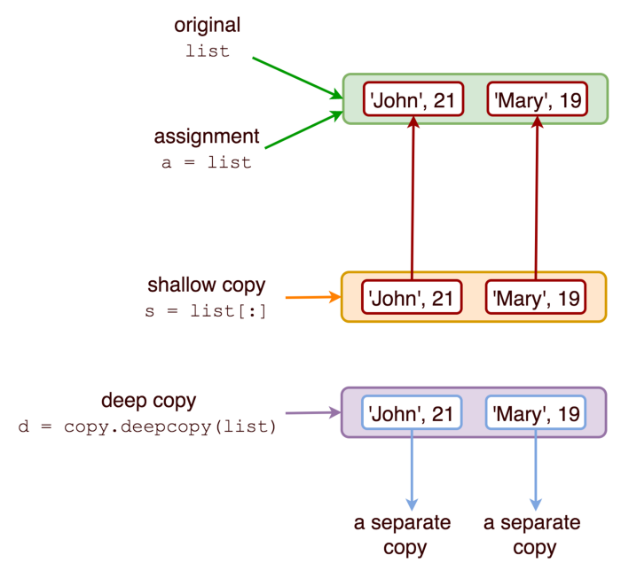

# <a href="https://www.python.org/"></a>&ensp; 다차원(2차원 이상) 배열의 생성 및 사용 (Multi Dimensional Array)

> 파이썬에서 2차원 배열을 생성하는 경우, 다음 그림과 같이 객체가 복합객체(`compound object`)인지 여부를 꼭 주의해야 함!


<p align="center">
    <br/>
    <a href="https://medium.com/@thawsitt/assignment-vs-shallow-copy-vs-deep-copy-in-python-f70c2f0ebd86">[그림 출처]</a>
</p>

---
## :one:&ensp; 이차원 배열 활용 방법

### 1. 선언
:point_right:&ensp; 사용 가능한 방법
```py
# 0 ~ n-1 까지의 이차원 리스트 0으로 초기화
a = [[0] * n for i in range(n)]
b = [[0 for _ in range(n)] for __ in range(n)]
```

:point_right:&ensp; 사용 불가능한 방법 (:warning:주의)
```python
# 이 표현은 2차원 배열을 생성하고자 할 때 사용 불가능!
c = [[0] * n] * n 
```
* `[[0] * n]`이 compound object 이고, list의 multiplication operator인 `'* operator'`가 `shallow copy 동작을 수행`하기 때문!

    <details>
    <summary>변수 <code>a, b, c</code>의 메모리 주소 확인</summary>

    ```py
    a = [[0] * n for _ in range(n)]
    b = [[0 for _ in range(n)] for __ in range(n)]
    c = [[0] * n] * n

    for i in range(n):
        print(hex(id(a[i])), hex(id(b[i])), hex(id(c[i])))

    """
    i   id(a[i])    id(b[i])    id(c[i])
    0   0x10ae76400 0x10ae76740 0x10ae83c80
    1   0x10ae838c0 0x10ae83cc0 0x10ae83c80
    2   0x10ae83480 0x10ae61b80 0x10ae83c80
    3   0x10ae83a00 0x10ae83b40 0x10ae83c80
    4   0x10ae83d80 0x10ae83840 0x10ae83c80
    """
    ```

    </details>