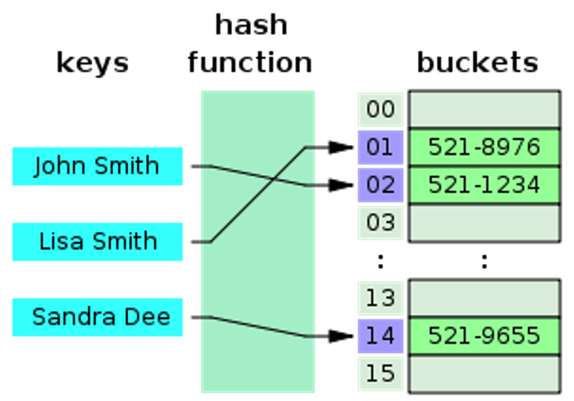
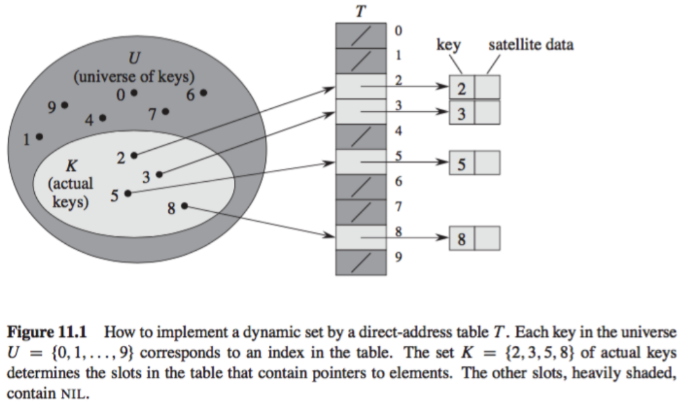

# Data Structrue

## Table of Contents

1. <a href="#ds-1">Array</a>

2. <a href="#ds-2">Linked List</a>

3. <a href="#ds-3">Stack</a>

4. <a href="#ds-4">Queue</a>

5. <a href="#ds-5">Tree(Basic)</a>

6. <a href="#ds-6">Tree(Advanced)</a>

7. <a href="#ds-7">Hash Table</a>

8. <a href="#ds-8">Graph</a>

9. <a href="#ds-9">Set</a>

 

---
<h2 id="ds-1">1️⃣&ensp; Array</h2>

### 0. Overview

### 1. 구현 및 참고자료

|Lang   |Material|
|:-:    |-|
| |[1차원 배열의 주요 메서드와 특징: List](./array/python/one_dimensional_array.md)|
| |[다차원(2차원 이상) 배열의 생성 및 사용: List](./array/python/multi_dimensional_array.md)|
| |[[외부 링크] Python, Memory, and Objects](https://towardsdatascience.com/python-memory-and-objects-e7bec4a2845): mutable object, immutable object, interning 개념 설명 잘되어있음.|
| |[[외부 링크] assignment("=") vs shallow copy vs deep copy](https://medium.com/@thawsitt/assignment-vs-shallow-copy-vs-deep-copy-in-python-f70c2f0ebd86)|
| |[배열 내 데이터의 탐색: 순차탐색](./array/python/sequential_search.md)|
| |[배열 내 데이터의 탐색: 이진탐색](./../../dongbin_book/chap7_binary_search/README.md)|
| |[Python Built-in List 자료형의 Operation 별 시간복잡도 정리](./array/timecomplexity.md)|

 

---
<h2 id="ds-2">2️⃣&ensp; Linked List</h2>

### 0. Overview

### 1. 구현 및 참고자료

 

---
<h2 id="ds-3">3️⃣&ensp; Stack</h2>

### 0. Overview

> Last in First Out(LIFO) 구조의 자료형. 원소 삽입 삭제의 시간복잡도가 으로 매우 빠름. 하지만 이론상 스택의 top을 제외한 나머지 스택 내 데이터의 탐색 시 원소를 하나씩 꺼내어 옮겨 담으면서 수행해야하는 단점이 있음.

 

:bulb:&ensp; 언제 사용할까?

> 재귀 알고리즘이나 백트래킹이 필요한 작업에서 활용하기 좋음.

 

:bulb:&ensp; 스택 자료형을 사용하는 대표적인 문제

* 괄호 검사

* 역순 문자열 만들기

* 후위 표기법으로의 변환

 

### 1. 구현 및 참고자료

|Lang   |Material|
|:-:    |-|
| |[List를 활용한 구현](./stack/python/stack_list.md)|
| |[deque 모듈 사용](./stack/python/stack_deque.md)|

 

---
<h2 id="ds-4">4️⃣&ensp; Queue</h2>

### 0. Overview

> First in First Out(FIFO) 구조의 자료형. 원소 삽입 삭제의 시간복잡도가 으로 매우 빠름.

 

:bulb:&ensp; 언제 사용할까?
* 데이터를 입력된 순서대로 처리하는 경우

* BFS 구현 시

 

:bulb:&ensp; 큐 자료형을 사용하는 대표적인 문제

* BFS 문제

* 콜센터 대기 순서

* 프로세스 관리

 

### 1. 구현 및 참고자료

|Lang   |Material|
|:-:    |-|
| |[List를 활용한 구현](./queue/python/queue_list.md)|
| |[collections.deque 모듈 사용 방법 및 Operation 별 Time Complexity 정리](./queue/python/queue_deque.md)|
| |선형 큐 구현|
| |순환 큐 구현|

 

---
<h2 id="ds-5">5️⃣&ensp; Tree(Basic)</h2>

### 0. Overview

계층적 관계(Hierarchical Relationship)을 표현하는 비선형 자료구조. 파일시스템과 같이 큰 데이터를 처리하는 소프트웨어들은 대부분 빠른 탐색을 위해, 데이터를 트리 자료구조 형태로 저장하여, 이진 탐색과 같은 탐색 기법을 활용함. 트리 구현을 위해서는 회로 Cycle이 존재하지 않아야 함.

:bulb:&ensp; [Tree 자료구조의 Terminology](./tree/terminology.md)

 

### 1. Tree의 종류(Basic)

이번 챕터에서는 Tree 자료구조의 기초인 `Binary Tree`, `Perfect Binary Tree`, `Perfect Binary Tree`, `Complete Binary Tree`, `Binary Search Tree(BST)`에 대해 알아본다. 더 복잡한 형태의 Tree 자료구조에 대해 궁금하다면 [Tree-Advanced 챕터](ds-5)에서 알아보자.

* Binary Tree(이진 트리)

    > `루트 노드를 중심으로 두개의 서브 트리`로 나뉘어지고, `나뉘어진 두 서브 트리 또한 모두 이진 트리인 트리`의 형태를 이진 트리라고 함. 이처럼 이진 트리는 재귀적으로 정의되기 때문에, 재귀적 정의 과정이 Leaf Node에 도달했을 때에도 정의를 만족하기 위해, `공집합 또한 이진 트리`로 포함하여야 함.

    배열로 구성된 이진 트리는 `노드의 갯수가 n개`이고, `root가 0이 아닌 1`에서 시작할 때, 다음과 같은 특징이 성립함.

    |i'th Node          |Parent     |
    |-                  |-          |
    |Parent Node        |`i // 2`    |
    |Left Child Node    |`i * 2`    |
    |Right Child Node   |`i * 2 + 1`|

    :bulb:&ensp; `i = 4`일 때의 예시는 다음과 같다.

    |Array Index|0|1|2|3|`4`|5|6|7|8|9|
    |:-:|:-:|:-:|:-:|:-:|:-:|:-:|:-:|:-:|:-:|:-:|
    ||Unused :x:|Root Node|Parent Node|-|`i th Node`|-|-|-|Left Child Node|Right child Node|
    ||-|-|`i // 2`|-|`i`|-|-|`i * 2`|`i * 2 + 1`|

 

* Perfect Binary Tree(포화 이진 트리)

    > 트리의 모든 내부 노드가 두개의 자식 노드를 가지며, 모든 Leaf Node가 동일한 깊이 또는 레벨을 갖는 트리. 다시 말해, `모든 리프 노드의 레벨이 동일`하고, `모든 레벨이 꽉 찬 이진 트리`를 의미.

 

* Complete Binary Tree(완전 이진 트리)

    > 부모 노드, 왼쪽 자식 노드, 오른쪽 자식 노드 순으로 채워지는 이진 트리. 마지막 레벨을 제외하고 모든 레벨이 완전히 채워져 있으며, 마지막 레벨의 노드들이 왼쪽부터 순서대로 채워져 있는 노드의 형태를 의미.

 

* Full Binary Tree(정 이진 트리) or Proper Binary Tree(적정 이진 트리)

    > 모든 노드가 0개 또는 2개의 자식 노드를 갖는 트리를 의미. (자식 노드의 갯수가 홀수 개가 아니여야 함.)

 

* Binary Search Tree(BST)

    > 효율적인 탐색을 위해서는 `데이터를 찾는 방법` 뿐만 아니라 `데이터를 저장하는 방법` 또한 중요하게 고려해야함. `Binary Search Tree(이진 탐색 트리)`는 이진트리의 일종으로, 특정 규칙에 따라 데이터를 저장하고, 이 규칙을 이후 데이터 탐색 시 활용하는 형태의 자료구조.

    * 규칙 1. 이진 탐색 트리에서 노드에 저장된 키는 유일해야 함.

    * 규칙 2. 부모 노드의 키가 왼쪽 자식 노드의 키보다 커야 함.

    * 규칙 3. 부모 노드의 키보다 오른쪽 자식 노드의 키가 커야 함.

    * 규칙 4. 특정 노드를 기준으로 왼쪽과 오른쪽의 서브트리 또한 이진 탐색 트리인 조건을 만족해야 함.

     

    :pushpin:&ensp; 이진 탐색 트리의 탐색 연산의 시간복잡도

    이진 탐색 트리의 탐색 연산은 의 시간 복잡도를 가짐. 이는 트리의 높이가 하나씩 증가될수록, 추가되는 노드의 수가 두 배씩 증가하기 때문.

    이와 같은 이진 탐색 트리는 `Skewed Tree(편향 트리)`가 될 수 있음. 저장 순서에 따라 계속 한 쪽으로만 노드가 추가되는 경우가 발생하기 때문. 이 경우, 성능에 영향을 미치게 되며, 탐색의 Worst Case가 되고 시간 복잡도는 이 됨.

    이처럼 배열보다 많은 메모리를 사용하며 데이터를 저장했지만 탐색에 필요한 시간 복잡도가 같게 되는 비효율적인 상황이 발생함. 이를 해결하기 위해 `Rebalancing 기법`이 등장함. `균형을 잡기 위한 트리 구조의 재조정`을 Rebalancing이라 하며, 이 기법을 구현한 트리에는 여러 종류가 존재하는데, 그 중에서 하나가 `Red-Black Tree`.

     

    :bulb:&ensp; 코딩테스트에서의 이진 탐색 트리 문제

    > 사실 코딩테스트에서는 문제 해결을 위해 필수적으로 이진 탐색 트리 자료구조를 구현해야하는 문제는 출제 빈도가 높지 않음.

 

### 2. 트리의 탐색/순회(Tree Traversal)

이진트리 및 전반적인 트리 구조에서 각가의 노드를 정확히 한 번만, 체계적으로 방문하는 과정을 말함. Tree Traversal 방식은 노드를 방문하는 순서에 따라 다음과 같이 분류됨. 아래의 트리 순회 방식 각각에 대한 설명은 이진 트리를 기준으로 작성되었지만, 다른 트리의 형태에도 일반화가 가능함.

|Tree Traversal         |Description|
|-                      |-          |
|in-order(중위 순회)      |왼쪽 자식 노드(L), 내 노드(P), 오른쪽 자식 노드(R) 순서로 방문.|
|pre-order(전위 순회)     |내 노드(P), 왼쪽 자식 노드(L), 오른쪽 자식 노드(R) 순서로 방문.|
|post-order(후위 순회)    |왼쪽 자식 노드(L), 오른쪽 자식 노드(R), 내 노드(P) 순서로 방문.|
|level-order(레벨 순회)   |내 노드(P)를 방문하고, 내 노드로부터 노드의 깊이가 낮은 순서대로 노드를 방문하는 방식.(`Depth = [0, 1, 2, ..., N(Depth)]`)|

 

### 3. 구현 및 참고자료

|Lang   |Material|
|:-:    |-|
| |Binary Search Tree 구현|
| |주어진 트리가 이진트리인지 여부를 확인하는 알고리즘 구현|

 

---
<h2 id="ds-6">6️⃣&ensp; Tree(Advanced)</h2>

### 1. Heap

 

### 2. Red Black Tree

 

### 3. Balanced Binary Tree(균형 이진 트리)

 

### 4. AVL Tree

 

### 5. Spanning Tree

 

---
<h2 id="ds-7">7️⃣&ensp; Hash Table</h2>

### 0. Overview

해시 테이블은 associative 방식으로 데이터를 저장하는 자료구조이다. 해시 테이블에서 데이터는 각 데이터 값에 `고유한 인덱스 값이 있는 배열 형식`으로 저장된다. 해시 테이블에서 저장하고자 하는 데이터에 대한 고유한 인덱스 값은 `Hashing Algorithm`을 이용하여 생성되고, 이 인덱스 값이 배열에 저장한다. 이처럼 `각각의 데이터에 대한 인덱스가 존재`하기 때문에, 원하는 데이터의 인덱스를 알면, 데이터의 크기와 관계 없이 매우 빠른 속도(average case에 대해 )로 데이터 액세스가 가능하다.

    
    
<a href="https://en.wikipedia.org/wiki/Hash_function">https://en.wikipedia.org/wiki/Hash_function</a>
 

#### :bulb:&ensp; **해시 테이블 자료구조의 Primary Operations**

|Operations|Description|Time Complexity|
|-|-|-|
|Search|해시 테이블에서 요소를 검색.|일반적으로 |
|Insert|해시 테이블에 새로운 요소를 추가.|일반적으로 |
|Delete|해시 테이블에 저장된 요소를 삭제.|일반적으로 |

 

### 1. Terminology

|Basic Terminology|Description|
|-|-|
|`Hash Function`|데이터의 효율적 관리를 목적으로 임의의 길이를 가진 데이터를 고정된 길이의 데이터로 매핑하는 함수.|
|`Hash Key`|Hash Function에 의해 고정된 길이의 데이터로 매핑되는 원본 데이터의 값.|
|`Hashcode`/`Hash Value`(`Index`)|Hash Function에 의해 생성된 고정된 길이의 데이터.|
|`Hashing`|매핑하는 과정 자체를 의미.|
|`Hashing Algorithm`|Hashing에 사용되는 알고리즘.|
|`Hash Table`|Hash Function을 사용하여 Hash Key를 Hash Value로 매핑하고, 이 Hash Value를 index(key)로 하여 데이터를 저장하는 형태의 자료구조.|
|`Bucket`/`Slot`|Hash Table에서 데이터가 저장되는 공간. 데이터 저장 위치는 Hash Key에 대응됨.|
|`Hash Collision`|서로 다른 두 개의 Key를 동일한 Hash Function을 통해 변환하였을 때, 동일한 Hash Value를 갖는 현상. 리얼 월드에서 Hash Table을 활용할 때, Hash Function은 대개 고정된 길이의 Hash Value가 표현 가능한 범위보다 더 많은 Key 값이 사용될 수 있고, 이는 Hash Collision을 야기할 수 있음.|

 

### 2. Deep Dive into `Hash Table` and `Hash Collision`

해시 테이블에서 Hash Function(해시 함수)은 데이터의 고유한 인덱스 값을 생성하고자 할 때 사용된다. 여기서 해시 함수는 `임의의 길이의 데이터를 고정된 길이의 데이터로 매핑`하는 함수를 뜻하며, 해시 함수에 의해 반환된 데이터의 고유한 값을 `hashcode`라고 한다. 이와 같이 해시 테이블은 `데이터를 저장`할 때 해시 함수에 의해 생성된 `hashcode 값을 배열에 저장`하기 때문에, 일반적인 경우  access가 가능하다.

 

#### :bulb:&ensp; **Direct-address Table**

이처럼 Hash Table은 배열의 인덱스를 통해 자료를 저장하는 자료구조인데, 왜 데이터의 `access/store`에 대한 Time Complexity가 균일하게 이 나오는 것이 아니라 average case에 대해서만 이 나오는 것일까? :thinking:

이는 서로 다른 두개의 데이터에 대해 해시 함수가 동일한 `hashcode`를 반환하는 `Hash Collision`이 발생할 수 있기 때문이다. (해시 테이블에서는 `Collision`을 해결하고자 `access/store` 과정에서 해시 충돌을 회피하는 로직이 추가된다.) 이렇게 되면 서로 다른 두개의 데이터가 같은 인덱스로 계산되는 동일한 키 값(hashcode)를 갖기 때문에, 배열 내에 데이터를 저장할 때 해당 인덱스로 접근되는 동일한 위치에 데이터가 저장되야 하는 현상(`Collision`)이 발생한다. Collision을 조금 더 깊게 이해하기 위해, 해시 테이블보다 단순한 형태인 `Direct-address Table`을 먼저 한번 살펴보자.

Direct-address Table은 Hash Table과 달리 data의 key를 직접적으로 버킷의 인덱스로 활용하는 자료구조이다. 이 때 Direct-address Table은 해시 테이블의 크기와 동일한 키 갯수를 사용하기 때문에, Collision 문제가 발생하지 않는다는 장점이 있다. 하지만 `전체 키 집합(U)`에 비해 `실제 사용하는 키 집합(K)`이 작은 경우, 사용되지 않는 키를 위한 메모리 할당을 해야하기 때문에 메모리 효율성이 크게 떨어지게 된다.

따라서 보통 Direct-address Table을 그대로 사용하기보다는, `해시 테이블의 크기(m)이 실제 사용하는 키의 갯수(n)보다 적은 해시 테이블`을 운용한다. 이처럼 해시 테이블의 크기를 실제 사용하는 키보다 적게 운용하기 때문에, 서로 다른 데이터에 대한 Hash Value가 동일하게 산출되는 Collision이 발생하게 되는 것이다. 이 때, `Hash Collision이 발생을 정량화하기 위한 지표`로, 해시 테이블의 한 버킷에 평균 몇개의 키가 매핑되는가를 나타내는 `load factor(적재율)`를 활용한다.

    

Direct-address Table의 load factor는 1 이하이며, load factor가 1 보다 큰 경우 Hash Collision 문제가 발생하게 된다.

 

### 3. How to Resolve Hash Collision?

앞서 Direct-address Table에서 살펴보았듯이, Hash Function를 무조건 1:1 로 만드는 것보다 Collision 을 최소화하는 방향으로 설계하고, 발생하는 Collision 에 대비해 어떻게 대응할 것인가가 더 중요하다. 1:1 대응이 되도록 만드는 것이 거의 불가능하기도 하지만 그런 hash function를 만들어봤자 그건 array 와 다를바 없고 메모리를 너무 차지하게 된다.

Collision이 많아질 수록 Search 에 필요한 Time Complexity가 에서 에 가까워진다. 어설픈 hash function는 hash 를 hash 답게 사용하지 못하도록 한다.

그렇다면 이러한 Hashmap 자료구조를 설계할 때, `Collision을 해결하기 위해 어떤 대응책`을 세울 수 있을까? :thinking:

일반적으로 Hashmap 자료구조의 Collision을 해결하기 위한 접근 방법은 `크게 두 가지`로, Collision을 낮추는 방향으로의 접근인 `좋은 Hash Function을 사용하는 방법`과 `Collision이 발생하더라도 이를 적절히 대응`하는 접근 방법으로 나눌 수 있다.

 

#### :one:&ensp; **좋은 Hash Function을 사용하기**

먼저, 좋은 Hash Function은 `어떤 조건`들을 가지고 있을까? :thinking:

좋은 Hash Function의 조건은 `Simple Uniform Hash`를 만드는 것을 말하며, Simple Uniform Hash의 조건은 다음과 같다.(좋은 Hash Function에 대해 더 깊게 알고싶다면 [링크 1](https://www.usna.edu/Users/cs/crabbe/IC312/current/units/06/unit.html), [링크 2](https://en.wikipedia.org/wiki/SUHA_(computer_science))를 읽어보자.)

    1. 버킷 배열의 크기가 m일 때, Hash Value들이 0 ~ m-1 사이의 범위에 해당되는 정수 값으로 균일한(uniform) 확률로 나타나야 함.

    2. Hash Function에 의해 생성된 각각의 Hash Value들은 서로 연관성을 가지지 않아야 함.(독립적으로 생성되야 함.)

이를 간단히 말하면, 좋은 Hash Function은 특정 값에 치우치지 않고 해시값을 고르게 생성하는 Hash Function이라고 할 수 있다. 

좋은 Hash Function을 지향하는 Hash Function은 정말 다양하지만, 이들 중 대표적인 방법 3가지 정도만 살펴보자.

1. **Division Method**

    Division Method는 modular 연산을 활용해, 가장 간단하면서도 빠른 연산이 가능한 Hash Function이다. Division Method의 Hashing은 을 통해 수행되며, 생성되는 Key는 `0 ~ m-1`의 범위 내에서 생성된다. 한편, Division Method를 사용하는 경우 `m`값을 어떻게 설정하는지가 매우 중요하다.

    먼저, `m`을 어떻게 설정하는지에 따라 해시 테이블의 성능이 크게 좌우되는데, m의 크기는 보통 Key의 수의 3배수가 적당하다고 한다.(적재율이 30% 정도쯤까지는 Collision 발생이 거의 일어나지 않음.)

    다음으로, `m` 값은 소수(Prime Number) 형태를 권장한다. `m`값이 과 같이 2의 거듭 제곱 형태라면, 2진수의 4자리 이하의 숫자만 Hash Value에 영향을 주게되기 때문이다.

        m   = 0x00001000
        k1  = 0x10111001
        k2  = 0x00001001
        h(k1) = h(k2) = 1

    정리하자면, Division Method을 활용하여 Hashing할 때의 최적의 `m`의 크기는 `key의 갯수의 3배 정도`이며, `2의 exponential에 근접한 Prime Number`를 선택해야 한다.

 

2. **Multiplication Method**

    숫자로 된 키가 `k`이고 `A`가 0과 1 사이의 실수일 때, Multiplication Method는 다음과 같이 정의됨. 이는 키를 0과 1 사이의 소수로 변환하고, 테이블의 크기 만큼 범위를 팽창시킨 것을 의미.

    

        
    

    보통 `m`값은 얼마가 되든 크게 중요하지 않으며, 2진수 연산에 최적화된 컴퓨터 구조를 고려하여, 보통 2의 제곱수로 정한다고 함. Multiplicion를 사용하여 Hashing하는 것은 Division Method를 사용하는 방식보다 다소 느리다고 함.

        m = 2 ** 12
        A = 0.12345
        k = 875654454
        hash_value = int((x * A) % 1 * m)

 

3. **Universal Hashing**

    Universal Hashing은 다수의 해시 함수를 만들고, 이 해시 함수의 집합 `H`에서 무작위로 해시 함수를 선택해 해시 값을 만드는 기법이다. Universal Hashing의 목적은 `H`에서 무작위로 해시 함수를 선택했을 때, 임의의 키 값이 임의의 해시 값에 매핑된 확률을 `1/m`으로 만드는 것이다. 
    
    확률론적 알고리즘(Probabilistic Algorithms)은 해시 함수가 충돌을 일으키는 특정 입력값 집합을 만나지 않게 될 것에 대한 증명 방법을 제공한다. 어떠한 주어진 입력값의 집합에 대해서도 임의의 해시 값을 생성하는 해시 함수들의 유니버설 집합(한쪽으로 훅 쏠리지 않는 집합)을 만들 수 있다. 여기에서 중요한 것은 주어진 입력 값에 대해 랜덤한 해시 값을 내는 해시 함수를 선택해준다는 것이다. 따라서 단순히 유니버설 집합으로부터 적절한 랜덤 함수를 선택하는 것만으로 어떠한 입력값에 대해서도 해시 값의 기대값이 임의적으로 분포한다고 증명할 수 있다.

 

사실, 해시 함수는 다대일(many-to-one) 대응이기 때문에, `비둘기집 원리(Pigeonhole principle)`에 의해 해시 함수값이 충돌하는 입력 값들의 집합이 반드시 존재하게 된다. 하지만 해시 함수를 사용할 때, 대부분 입력 값 집합에 대해 충돌이 적게 나는 해시함수를 사용하기를 원하는데, 수학적으로, 해시 함수에 충돌이 나는 입력 값 집합이 들어오지 않는다고 보장하는 것은 불가능하다.

 

#### :two:&ensp; **Collision 발생 시, 이를 적절히 대응하기**

* **Open Addressing 방식(개방 주소법)**

 

* **Separate Chaining 방식(분리 연결법)**

 

#### :bulb:&ensp; `Open Addressing` vs `Seperate Chaining`

|                   |Time Complexity    |Bucket Resize|
|-                  |-                  |-|
|Open Addressing    |||
|Separate Chaining  |||

* 

 

### 4. 해시 버킷 동적 확장(Resize)

 

### 5. 구현 및 참고자료

|Lang   |Material|
|:-:    |-|
| |[Dictionary 자료형](./hashtable/python/dictionary.md)|

 

---
<h2 id="ds-8">8️⃣&ensp; Graph</h2>

### 0. Overview

### 1. 구현 및 참고자료

|Lang   |Material|
|:-:    |-|
| |[인접행렬 구현](./graph/python/adjacent_matrix.md)|
| |[인접 리스트 구현](./graph/python/adjacent_list.md)|
| |[간선리스트 구현](./graph/python/edge_list.md)|

### 2.  Edge Cases

 

---
<h2 id="ds-9">9️⃣&ensp; Set</h2>

### 0. Overview

`집합(Set)`은 `원소(Member)`라는 구별되는 객체들이 연관되어 모인 것을 말하며, `서로 다른 연관된 원소`들의 `순서 없는` 모임이다.

### 1. 구현 및 참고자료

|Lang   |Material|
|:-:    |-|
| |[set 자료형](./set/python/set.md)|

 

---
## References

### Overall

- https://www.geeksforgeeks.org/data-structures/

- https://www.tutorialspoint.com/data_structures_algorithms/index.htm

- https://github.com/JaeYeopHan/Interview_Question_for_Beginner/tree/master/DataStructure

- 동빈북

- 파이썬 알고리즘 인터뷰

### Hash Table

- https://web.stanford.edu/class/archive/cs/cs161/cs161.1168/lecture9.pdf

- https://ratsgo.github.io/data%20structure&algorithm/2017/10/25/hash/

- https://ict-nroo.tistory.com/76

- https://baeharam.netlify.app/posts/data%20structure/hash-table

- https://bcho.tistory.com/1072

- https://d2.naver.com/helloworld/831311

- https://en.wikipedia.org/wiki/Hash_table

- https://ko.wikipedia.org/wiki/%EC%9C%A0%EB%8B%88%EB%B2%84%EC%84%A4_%ED%95%B4%EC%8B%B1