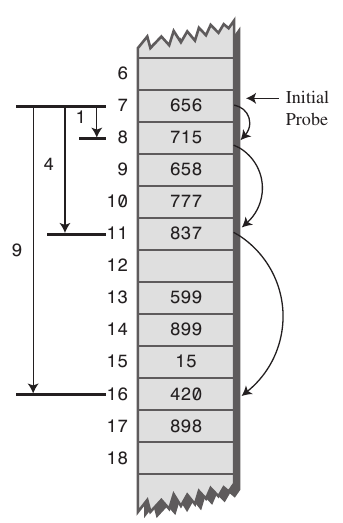

# Hashing with Open Addressing(개방 주소법)

## Table of Contents

본 문서에서는 다음의 내용을 중점으로 다룬다.

1. <a href="#sec_01">Open Addressing 기법을 활용하여 Hash Table을 관리하는 방법</a>

2. <a href="#sec_02">Open Addressing에서 Probing(탐사) 방법</a>

3. <a href="#sec_03">Open Addressing을 활용할 때, 삽입/삭제/탐색 연산의 시간 복잡도</a>

 

---
<h2 id="sec_01">1️⃣&ensp; What is Open Addressing?</h2>

Open Addressing(Closed Hashing)은 해시 테이블 자료구조에서 collision을 해결하기 위한 방법이다. Open Addressing은 삽입/삭제/탐색을 수행하기 위해, hash collision 발생 시 해시 테이블 내 새로운 주소(해시 값)을 찾는 Probing(탐사) 과정을 추가적으로 수행하는 방식을 통해 collision을 해결한다.

해시 값을 바로 해시 테이블 내 버킷의 주소로 활용하는 naive approach와 비교했을 때, Open Addressing에서는 해시 값이 그대로 해시 테이블 내 버킷의 주소로 매핑되는 것이 아니라 x칸만큼(Probing 종류에 따라 달라짐) 떨어진 곳에 저장 될 수 있다.

    
    
<a href="https://en.wikipedia.org/wiki/Open_addressing">https://en.wikipedia.org/wiki/Open_addressing</a>

 

### **1. Open Addressing을 사용하는 Hash Table의 Operations**

|Operation|Descriptions|
|-|-|
|`Insert(k)`|빈 슬롯을 찾을 때 까지 계속 탐색함. 만약 빈 슬롯이 발견되면 `k`를 삽입함.|
|`Search(k)`|슬롯의 키가 `k`와 같지 않거나, 빈 슬롯에 도달할 때 까지 탐색을 수행함.|
|`Delete(k)`|삭제된 키에 해당되는 슬롯에 삭제된(`DELETED`) 슬롯이라고 마킹함. 이는 단순히 키를 삭제하게되면 `Search` 동작에 영향을 줄 수 있기 때문.|

 

### **2. Open Addressing 예시**

다음 조건에 따라 Open Addressing 방식으로 `해시 테이블(T)`에 키를 순차적으로 저장하고자 할 때, 각각의 단계에 대해 알아보자.

* 로 정의.

* `key(k)`는 `50, 700, 76, 85, 92, 73, 101` 순서로 저장된다.

* `Linear Probing(선형 탐사)` 방식을 활용: Collision 발생 시, Collision이 발생한 해시 테이블의 슬롯보다 `1칸 뒤`에 데이터를 저장함.

    
    
<a href="https://www.geeksforgeeks.org/hashing-set-3-open-addressing/">https://www.geeksforgeeks.org/hashing-set-3-open-addressing/</a>

 

|Setps|Descriptions|Collision|
|-|-|:-:|
|1. Initial Empty Table|크기가 7인 해시 테이블(T)의 초기 상태.|X|
|2. Insert(50)|로 `T[1]`에 `50`이 저장됨.|X|
|3. Insert(700)|으로 `T[0]`에 `700`이 저장됨.|X|
|4. Insert(76)|으로 `T[6]`에 `76`이 저장됨.|X|
|5. Insert(85)|으로 `T[1]`에 이미 데이터가 저장되어 있음. Collision이 발생하였기 때문에, 빈 슬롯을 찾을 때 까지 1칸씩 계속 탐색 수행.|O|
|6. Insert(92)|으로 `T[1]`에 이미 데이터가 저장되어 있음. Collision이 발생하였기 때문에, 빈 슬롯을 찾을 때 까지 1칸씩 계속 탐색 수행. `T[2]`에도 데이터가 있기 때문에 `T[3]` 위치에 `92` 삽입.|O|
|7. Insert(73)|으로 `T[3]`에 이미 데이터가 저장되어 있음. 따라서 `T[4]`의 위치에 `92` 삽입.|O|
|7. Insert(101)|으로 `T[3]`에 이미 데이터가 저장되어 있음. 따라서 `T[5]`의 위치에 `101` 삽입.|O|

 

---
<h2 id="sec_02">2️⃣&ensp; Probings(탐사)</h2>

Probing(탐사)이란 삽입/삭제/탐색을 수행하기 위해 해시 테이블 내 새로운 주소(해시 값)을 찾는 과정을 의미한다. Probing은 충돌이 발생했을 때, 충돌이 발생한 키를 기준으로 엑세스할 위치를 어떻게 설정할지에 따라 1)`Linear Probing`, 2)`Quadratic Probing`, 3)`Double Hashing` 등으로 분류할 수 있음.

위의 Probing 방식들은 `이동 폭(충돌이 발생한 위치와 새롭게 저장될 위치의 offset)정`과 `초기 해시 값 설정` 등에 변화를 주어 충돌을 회피함.

 

### 1. **Linear Probing(선형 탐사)**

선형 탐사 방식은 충돌 발생 시, `고정된 이동 폭`을 (충돌이 발생한 위치와 새롭게 저장될 위치의 offset)만큼 떨어진 위치에 엑세스(삽입/삭제/탐색)하는 방식이다.

예를 들어 임의의 키에 대한 해시 값을 인덱스로 하여 해시 테이블 내 버킷에 엑세스 시 충돌이 발생하면, 해당 해시 값에서 `고정 폭(x칸)`만큼 떨어진 위치에 해당되는 버킷에 엑세스를 시도. 만약 이동한 위치에 데이터가 없다면(충돌이 발생하지 않는다면) 해당 버킷에 데이터를 삽입/삭제/탐색 수행. 하지만 버킷 내 데이터가 존재한다면 다시 x칸만큼 이동을 수행하는 방법.

    
    
<a href="https://stackoverflow.com/questions/27742285/what-is-primary-and-secondary-clustering-in-hash">https://stackoverflow.com/questions/27742285/what-is-primary-and-secondary-clustering-in-hash</a>

 

Linear Probing은 탐사 이동폭이 고정되어 있어, 최초 해시 값을 52로 하여 해시 테이블 내 버킷에 엑세스를 시도했을 때, 위의 그림처럼 Initial Probe 주변 버킷에 데이터가 채워져있는 경우 성능이 낮아지고, 이를 `Primary Clustering 문제`라고 한다.

 

### **2. Quadratic Probing(제곱 탐사)**

제곱 탐사 방식은 충돌 발생 시, `제곱수의 이동 폭`을 (충돌이 발생한 위치와 새롭게 저장될 위치의 offset)만큼 떨어진 위치에 엑세스(삽입/삭제/탐색)하는 방식이다.

예를 들어 임의의 키에 대한 해시 값을 인덱스로 하여 해시 테이블 내 버킷에 엑세스 시 충돌이 발생하면, 해당 해시 값에서 `제곱수인 이동 폭`(칸)만큼 떨어진 위치에 해당되는 버킷에 엑세스를 시도. 만약 이동한 위치에 데이터가 없다면(충돌이 발생하지 않는다면) 해당 버킷에 데이터를 삽입/삭제/탐색 수행. 하지만 버킷 내 데이터가 존재한다면 다시 칸만큼 이동을 수행하는 방법.

    
    
<a href="https://stackoverflow.com/questions/27742285/what-is-primary-and-secondary-clustering-in-hash">https://stackoverflow.com/questions/27742285/what-is-primary-and-secondary-clustering-in-hash</a>

 

Quadratic Probing은 제곱수의 이동 폭을 갖는다. 따라서 Linear Probing에 비해 이동 폭이 넓어, Primary Clustering 문제를 보다 쉽게 벗어날 수 있다. 하지만 Quadratic Probing은 여러 개의 서로 다른 키들이 동일한 초기 해시값을 갖는 `Secondary Clustering`에 취약하다. 초기 해시 값이 동일하다면 이동 폭의 크기와 상관 없이 다음 탐사 위치 또한 동일하기 때문에, Probing을 통해 access하는 버킷의 순서가 동일하다. 이와 같은 문제 때문에 탐사 효율성이 저하될 수 있으며, 이를 해결하기 위한 대표적인 Probing은 `Double Hasing` 방식이 있다.

 

### **3. Double Hashing(이중 해싱)**

Double Hashing 방식은 `2개의 해시 함수를 사용`하여 탐사할 해시 값의 규칙성을 없애, clustering을 방지하는 기법이다. Double Hashing 방식에서 각각의 해시 함수는 아래와 같은 목적으로 사용된다.

* Hash Function 1: `최초 해시 값`을 얻을 때 사용.

* Hash Function 2: `탐사 이동 폭`을 구할 때 사용.

 

이처럼 `최초 해시 값을 얻을 때 사용되는 해시 함수`와 `탐사 이동 폭을 구할 때 사용되는 해시 함수`를 다르게 하여, Primary Clustering과  Secondary Clustering 문제를 모두 해결할 수 있다. (단, 최초 해시 값과 탐사 이동폭이 서로소 관계여야 효과가 나타난다.) Double Hashing은 해싱이 한번 더 들어가기 때문에 Linear/Quadratic Probing 방식에 비해 더 많은 연산량이 요구된다.

* `Primary Clustering의 해결`: 최초 해시 값이 같더라도 탐사 이동폭을 다르게 함.

* `Secondary Clustering의 해결`: 탐사 이동 폭이 같더라도 최초 해시 값을 다르게 함.

 

---
<h2 id="sec_03">3️⃣&ensp; Time Complexity</h2>

### 1. Uniform Probing

다음 두 가지를 전제하여 Open Addressing의 탐색(Search) 연산에 대한 Time Complexity를 분석해보자.(삭제와 삽입 또한 Probing 횟수에 영향을 받기 때문에 Search 연산을 대표로 살펴봄.)

1. 해시 테이블에 데이터가 모두 적재되지 않은 상태를 전제.

    * 다시 말해 `고정된 해시 테이블의 크기(m)`에 `n개의 데이터`를 모두 저장하는 경우에 대해, Load Factor 값인 `a`가 이 되는 것을 가정하여 Time Complexity를 분석한다.

2. 키들이 모든 버킷에 균등하게 할당된 상황을 가정(`Uniform Hashing`).

 

Open Addressing Probing의 Time Complexity는 Probing(탐사) 횟수에 비례한다. 다시 말해 충돌을 회피하여 원하는 버킷에 access하기 위해, Probing을 통해 특정 이동 폭으로 몇번 이동했는지에 따라 Probing의 성능이 계산되는 것이다. 이에 따라 Open Addressing Probing의 Search 연산에 대한 Time Complexity를 계산할 때는, 기대값(Expected Value:  개념을 활용하여 Probing 횟수의 기댓값을 계산한다. 이에 따른 `Successful Search`와 `Unsuccessful Search`의 탐사 횟수에 대한 기댓값은 아래와 같다.

|Case|Time Complexity|Load Factor   (`a=0.5`)|Load Factor   (`a=0.8`)|
|:-:|:-:|:-:|:-:|
|`Successful Search`||`1.3862`|`2.0117`|
|`Unsuccessful Search`||`2`|`5`|

위의 표를 보면 `a = 0.5`(데이터가 반만 채워져 있음) 인 경우 최초 해시값을 만드는 1회 연산을 제외한 나머지인 1번만큼만 추가 탐사를 진행하면 검색을 완료할 수 있지만, `a = 0.8`로 load factor가 증가하면 기대값이 급격하게 증가할 수 있다.

 

### 2. Linear Probing vs Uniform Probing

||Unsuccessful Search|Successful Search|
|-|:-:|:-:|
|Uniform Probing|||
|Linear Probing|||

 

    <a href="http://www.cs.tau.ac.il/~zwick/Adv-Alg-2015/Linear-Probing.pdf">Expected number of probes</a>

load factor(a)가 0.6 이하인 경우, 두 probing 모두 constrants이 적게 나타난다.

이처럼 Open Addressing의 Probing 연산에 대한 Time Complexity는 load factor(테이블에 데이터가 얼마나 채워져있는지)에 크게 영향을 받는다. 따라서 해시 테이블의 데이터가 어느정도 차게 되면 해시 테이블의 크기(m)을 적절히 늘리고(`Resizing`) 다시 해싱을 수행하는 것이 좋다고 한다.

|Lang   |Material|
|:-:    |-|
| |[CPython 3.3을 기준으로 `load factor가 2/3` 정도가 되었을 때, Resizing을 수행한다.](https://tenthousandmeters.com/blog/python-behind-the-scenes-10-how-python-dictionaries-work/)|
||[Java의 HashMap은 `load factor가 3/4(=0.75)` 정도가 되었을 때, Resizing을 수행한다.](https://d2.naver.com/helloworld/831311)|

 

> :bulb: 정리하자면 Hash Table을 사용할 때 Probing 연산의 Time Complexity는 load factor의 크기와 밀접한 연관을 갖는다. 따라서 Hash Table을 구현하게 된다면 최적의 Load Factor를 지정하는 것이 성능 향상에 매우 중요하다.

 

---
## Reference

* https://ratsgo.github.io/data%20structure&algorithm/2017/10/25/hash/

* https://stackoverflow.com/questions/27742285/what-is-primary-and-secondary-clustering-in-hash

* https://nlp.jbnu.ac.kr/AL/ch06.pdf

* http://www.cs.tau.ac.il/~zwick/Adv-Alg-2015/Linear-Probing.pdf