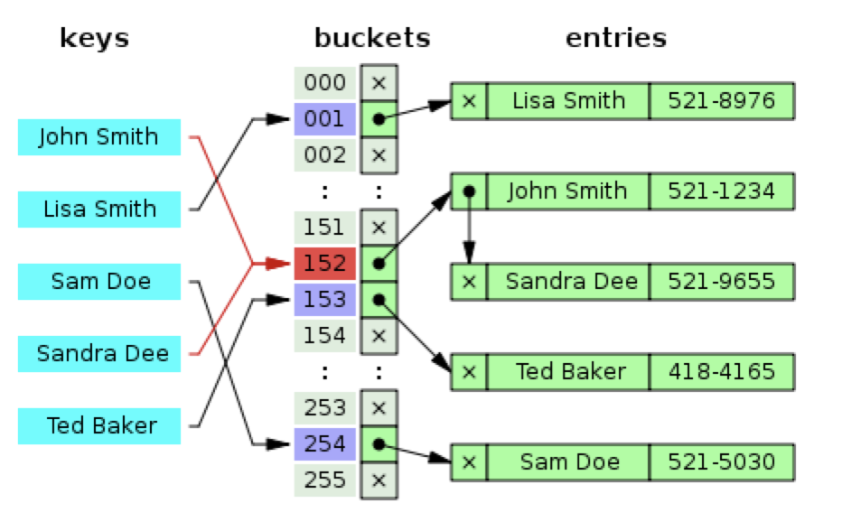

# Hashing with Separate Chaining(분리 연결법)

본 문서에서는 다음의 내용을 중점으로 다룬다.

1. <a href="#sec_01">Separate Chaining 기법을 활용하여 Hash Table을 관리하는 방법</a>

2. <a href="#sec_02">Separate Chaining을 활용할 때, 삽입/삭제/탐색 연산의 시간 복잡도</a>

 

---
<h2 id="sec_01">1️⃣&ensp; What is Separate Chaining?</h2>

Separate Chaining은 해시 충돌 문제를 해결하기 위해, 연결 리스트를 활용하여 버킷 당 들어갈 수 있는 엔트리의 수를 제한하지 않도록 하는 방법이다. 데이터 삽입 시 대상 버킷에 이미 데이터가 적재되어있다면, 연결 리스트에 노드를 연결 리스트의 head 추가하는 방식()으로 구현되어 있다.(구현하기 나름 tail에 추가해도 됨. 이 경우 삽입 연산에 대한 시간 복잡도는 이 됨.) 이 때문에 Separate Chaining은 유연한 사용이 가능하다는 장점이 있으나, 메모리 문제가 야기될 수 있다.

    
    
<a href="https://en.wikipedia.org/wiki/Hash_table">https://en.wikipedia.org/wiki/Hash_table</a>

 

---
<h2 id="sec_02">3️⃣&ensp; Time Complexity</h2>

실제 사용하는 키의 갯수가 `n`이고, 크기가 `m`인 해시 테이블에서 해시 함수의 키들이 모든 버킷에 균등하게(Uniformly) 분포되어있다고 가정하고 삽입/삭제/탐색 연산의 시간 복잡도를 계산해보자.

### 1. 삽입 연산의 Time Complexity

|Operation|Successful|Unsuccessul|
|:-:|:-:|:-:|
|Insert||-|
|Search|||
|Delete|||

 

삽입 연산의 시간 복잡도는 앞서 언급하였듯이 연결 리스트의 어느 부분(head or tail)에 데이터를 삽입할지를 구현하기에 따라 다르지만 본 문서에서는 이후 탐색/삭제 연산의 시간 복잡도 계산 과정의 편의를 위해, `head에 데이터가 삽입되도록 연결 리스트가 구현되었다고 전제`하고 설명한다.

* `head에 데이터를 삽입하는 경우`: 

* tail에 데이터를 삽입하는 경우: 

  * 여기서 `a`은 collision이 버킷에 연결된 연결 리스트에 존재하는 데이터의 갯수를 의미한다.

  * 앞서 해시 테이블에서 해시 함수의 키들이 모든 버킷에 균등하게(Uniformly) 분포되어있다고 가정하였기 때문에, 버킷 하나당 존재하는 키의 갯수는 이 된다.

 

### 2. 탐색 연산의 Time Complexity

탐색 연산의 시간 복잡도는 다음 두 가지 경우로 나누어 계산할 수 있다.

1. `Unsuccessful Search`: 탐색 대상 데이터가 해시 테이블에 존재하지 않는 경우.

    해시 테이블에 탐색 대상 데이터(키)가 없다는 것을 알려면, 키를 해시 값으로 변환하고 해당 해시 값에 해당되는 버킷의 연결 리스트 내 모든 요소들을 탐색해봐야 한다. 따라서 탐색 대상 키의 해시 값에 해당되는 버킷의 연결 리스트 내 모든 요소들을 탐색하는데 필요한 비용은 이 된다.

    * 해싱: 
    * 연결 리스트 탐색: 

 

2. `Successful Search`: 탐색 대상 데이터가 해시 테이블에 존재하는 경우.

    Big-O Notation은 최약의 경우를 가정하기 때문에, tail에 데이터가 존재하는 경우가 최악의 케이스가 된다. 따라서 Successful Search의 시간 복잡도는 Unsuccessful Search의 시간 복잡도와 동일한 가 된다.(해싱 연산의 시간 복잡도는 무시함.)

 

### 3. 삭제 연산의 Time Complexity

삭제 연산은 탐색 연산과 본질적으로 유사하고, 차이점이 있다면 삭제할 데이터에 대한 unlink 로직만 추가된다. 따라서 삭제 연산의 시간 복잡도는 탐색 연산의 복잡도와 동일하다.

 

---
## Reference

* https://ratsgo.github.io/data%20structure&algorithm/2017/10/25/hash/
