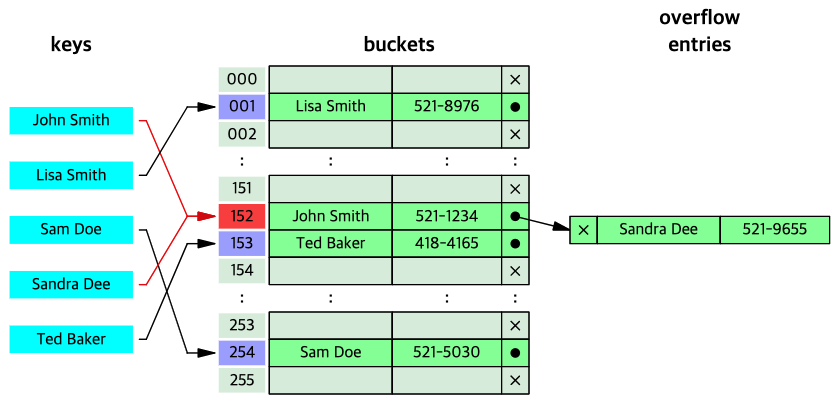

# Hashing with Separate Chaining(분리 연결법)

본 문서에서는 다음의 내용을 중점으로 다룬다.

1. <a href="#sec_01">Separate Chaining 기법을 활용하여 Hash Table을 관리하는 방법</a>

2. <a href="#sec_02">Separate Chaining을 활용할 때, 삽입/삭제/탐색 연산의 시간 복잡도</a>

 

---
<h2 id="sec_01">1️⃣&ensp; What is Separate Chaining?</h2>

Separate Chaining은 해시 충돌 문제를 해결하기 위해, 연결 리스트를 활용하여 버킷 당 들어갈 수 있는 엔트리의 수를 제한하지 않도록 하는 방법이다. 데이터 삽입 시 대상 버킷에 이미 데이터가 적재되어있다면, 연결 리스트에 노드를 연결 리스트의 head 추가하는 방식()으로 구현되어 있다.(구현하기 나름 tail에 추가해도 됨. 이 경우 삽입 연산에 대한 시간 복잡도는 이 됨.) 이 때문에 Separate Chaining은 유연한 사용이 가능하다는 장점이 있으나, 메모리 문제가 야기될 수 있다.

    
    
<a href="https://en.wikipedia.org/wiki/Hash_table">https://en.wikipedia.org/wiki/Hash_table</a>

 

---
<h2 id="sec_02">3️⃣&ensp; Time Complexity</h2>

### 1. 삽입 연산의 Time Complexity

 

### 2. 탐색/삭제 연산의 Time Complexity

 

---
## Reference

* https://ratsgo.github.io/data%20structure&algorithm/2017/10/25/hash/
