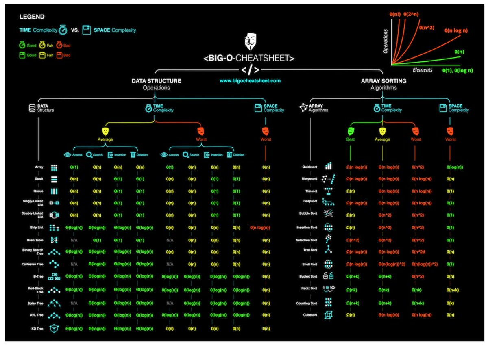

# Time Complixity

<a href="https://stackoverflow.com/questions/559839/big-o-summary-for-java-collections-framework-implementations">Link</a>

## 1. 일반적인 경우의 연산 유형별 시간복잡도 & 제한시간 1초 기준 입력 크기

<table>
<thead>
<tr>
<th>시간복잡도</th>
<th>연산 유형</th>
<th>입력의 크기</th>
</tr>
</thead>

<tbody>
<tr>
<td></td>
<td>단순 계산(a+b, 배열 접근 연산)</td>
<td>-</td>
</tr>
<tr>
<td></td>
<td>N개를 절반으로 나눔</td>
<td>-</td>
</tr>
<tr>
<td></td>
<td>1중 for문</td>
<td>1억</td>
</tr>
<tr>
<td></td>
<td>-</td>
<td>5백만</td>
</tr>
<tr>
<td></td>
<td>2중 for문</td>
<td>1만</td>
</tr>
<tr>
<td></td>
<td>3중 for문</td>
<td>500</td>
</tr>
<tr>
<td></td>
<td>크기가 N인 집합의 부분집합</td>
<td>20</td>
</tr>
<tr>
<td></td>
<td>크기가 N인 순열</td>
<td>10</td>
</tr>
</tbody>
</table> 

---
## 2. 시간 복잡도의 계산
:point_right:&nbsp; 기본적인 시간복잡도 계산 방법

   * 상수는 버림

   * 두 항에서, 변수가 같으면 큰것만 남기고 버림

   * 두 항에서 변수가 다른 경우 놔둠: 